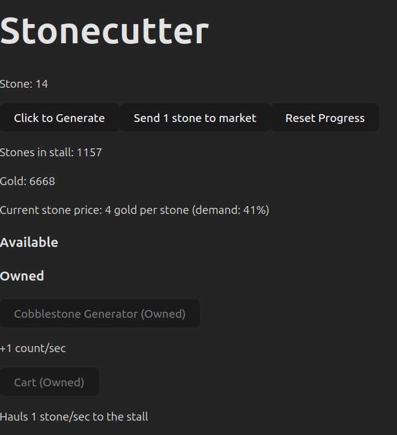

# Stonecutter

Always dreamt of being a stonemason? Now you can live the dream!



## Running

- Ensure [Node.js](https://nodejs.org/) is installed
- Ensure [npm](https://www.npmjs.com/) is installed

- Run the following command to install dependencies:
    ```
    npm install
    ```
- Start the development server (with hot-reloading) by running:
     ```
     npm run dev
     ```
- The application will typically run at http://localhost:5173
